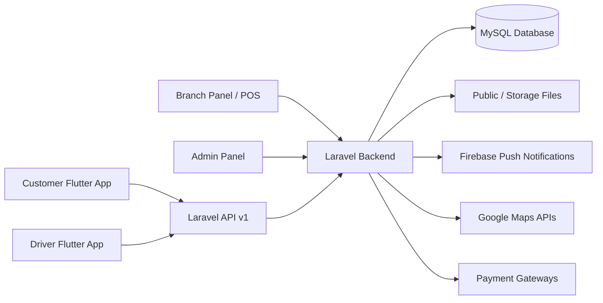
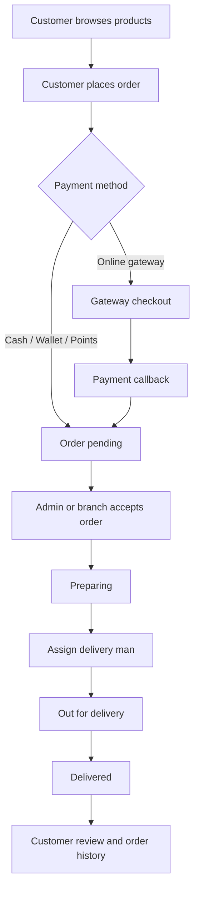

# Restaurant Pizzeria

Restaurant Pizzeria is a Laravel-based restaurant ordering and delivery marketplace package. It includes a web backend for system administration, a branch/restaurant operations panel, API endpoints for customer and delivery apps, POS/order workflows, payment gateway integrations, Firebase push notification support, and optional table/kitchen modules.

This documentation is written for both non-technical buyers who are installing the script on hosting and developers who need to configure or customize the package.

## Package Overview

| Area | Purpose |
| --- | --- |
| Public landing pages | Homepage, About Us, Terms and Conditions, Privacy Policy |
| Admin panel | Global dashboard, branch management, product/catalog setup, orders, promotions, employees, delivery men, business settings |
| Branch panel | Branch dashboard, POS, branch orders, product pricing, tables, kitchen, reports |
| Customer API | Registration, login, profile, addresses, products, categories, cart/order placement, tracking, wallet, loyalty points, messages |
| Delivery API | Delivery login, profile, current/all orders, order status updates, location tracking, messages |
| Payment flows | SSLCommerz, PayPal, Stripe, Razorpay, PayStack, bKash, Paymob, Mercado Pago, Flutterwave, Payconiq, internal wallet/points |
| Installer | Browser-based installation wizard at `/install` |

## Server Requirements

Use a hosting plan or VPS that supports Laravel applications.

- PHP 8.0 or higher
- MySQL database
- Composer
- PHP extensions: `curl`, `openssl`, `pdo`, `pdo_mysql`, `bcmath`, `mbstring`, `tokenizer`, `xml`, `fileinfo`, `json`
- Writable `storage`, `bootstrap/cache`, and `.env`
- Apache with `mod_rewrite` or Nginx configured to serve the `public` directory
- SSL certificate for production use

Recommended production settings:

- Point the domain document root to `public`
- Keep `APP_DEBUG=false`
- Use HTTPS in `APP_URL`
- Run queue workers if you change `QUEUE_CONNECTION` from `sync`
- Configure cron for Laravel scheduler if scheduled tasks are added

## Getting Started

1. Upload the project files to your hosting account or server.
2. Create an empty MySQL database and database user from your hosting control panel.
3. Make sure the domain points to the Laravel `public` directory.
4. Open your website in the browser and go to:

```text
https://your-domain.com/install
```

5. Follow the installer screens:

| Step | What to do |
| --- | --- |
| Welcome | Start the installation wizard |
| Requirements | Confirm PHP version, writable folders, `.env` access, and MySQL support |
| Environment | Enter app name, app URL, debug mode, and database credentials |
| Database | Test the database connection |
| Migrations | Run database migrations and seed required data |
| Admin | Create the first admin account |
| Finish | Finalize installation and open the admin login page |

After installation, the app sets `APP_INSTALL=true` and creates an install lock file in `storage/installed.lock`.

## Non-Technical Deployment Guide

Use these steps if you are installing through cPanel or a similar hosting panel.

1. Open **File Manager** and upload the package files.
2. Move all project files outside `public_html` if your hosting supports a private application folder.
3. Point your domain document root to the project `public` folder. If your host cannot change the document root, contact hosting support because Laravel apps should not expose root files such as `.env`.
4. Open **MySQL Databases** and create:
   - One database
   - One database user
   - Full privileges for that user on the database
5. Open the browser installer at `/install`.
6. Enter the database details exactly as shown in the hosting control panel.
7. Create your admin account in the installer.
8. After installation, log in to the admin panel and complete business settings before testing orders.

If the installer says a folder is not writable, set write permission for `storage` and `bootstrap/cache`. On many hosting panels this is done through **File Manager > Permissions**.

## Manual Developer Installation

Use this flow for local development or VPS deployment.

```bash
composer install --no-dev --optimize-autoloader
cp .env.example .env
php artisan key:generate
php artisan migrate --force
php artisan db:seed --force
php artisan storage:link
php artisan optimize:clear
php artisan config:cache
```

Then update `.env`:

```env
APP_NAME="Restaurant Pizzeria"
APP_ENV=production
APP_DEBUG=false
APP_URL=https://your-domain.com
APP_INSTALL=true

DB_CONNECTION=mysql
DB_HOST=127.0.0.1
DB_PORT=3306
DB_DATABASE=your_database
DB_USERNAME=your_user
DB_PASSWORD=your_password
```

For local-only testing after seeding, the default seeded admin is:

```text
Email: admin@admin.com
Password: 12345678
```

For production, create a strong admin account through the installer or change the seeded credentials immediately.

## Important URLs

| URL | Purpose |
| --- | --- |
| `/` | Public landing page |
| `/install` | Browser installer |
| `/admin/auth/login` | Admin login |
| `/branch/auth/login` | Branch login |
| `/api/v1/...` | Mobile app and branch API endpoints |
| `/payment-mobile` | Mobile payment selector flow |

## Admin Setup Walkthrough

After the first login, configure the application in this order:

1. Open **Business Settings** and add restaurant name, logo, favicon, timezone, currency, tax, delivery options, order settings, and language settings.
2. Configure Firebase push notifications and Google Maps keys if mobile apps use live push/location features.
3. Configure payment gateways from the admin payment/settings area.
4. Create branches and branch users.
5. Add categories, subcategories, products, add-ons, attributes, and product variations.
6. Add delivery men or allow delivery man registration if enabled.
7. Configure coupons, banners, notifications, and other promotions.
8. Place a test order from the customer app or API and process it through admin/branch and delivery workflows.

## Component Interaction Flow



## Order Processing Flow



## Branding Customization Guide

Most buyer-facing branding is managed from the admin panel after installation.

| Branding item | Where to update |
| --- | --- |
| Restaurant/app name | Admin panel > Business Settings |
| Logo and favicon | Admin panel > Business Settings |
| Currency and symbol position | Admin panel > Business Settings |
| Timezone and time format | Admin panel > Business Settings |
| Landing page content | `resources/views/landing` and public landing assets |
| Admin panel images | `public/assets/admin/img` |
| Installer logo | `public/assets/installation/assets/img/logo.svg` |
| Static pages | `resources/views/about-us.blade.php`, `terms-and-conditions.blade.php`, `privacy-policy.blade.php` |
| Mobile API base URL | Configure in the Flutter apps to point to your installed domain |

Recommended branding process:

1. Prepare logo, favicon, splash screen, and app icons before deployment.
2. Install the backend and update business settings first.
3. Replace static page content with your legal/business copy.
4. Update mobile app package names, app names, icons, API base URL, Firebase config, and Google Maps keys.
5. Test customer registration, order placement, push notifications, payment, driver assignment, and order completion.

## Third-Party Services Checklist

These services are not included with the source code and must be created separately when needed.

- Hosting or VPS
- Domain and SSL certificate
- MySQL database
- Firebase project for push notifications
- Google Maps API key for maps/location features
- Payment gateway merchant accounts
- SMS provider account if phone verification or SMS notifications are enabled
- Email SMTP account if email sending is enabled
- Android/iOS developer accounts for publishing mobile apps

## Screenshots To Include In Documentation

Before marketplace resubmission, add real high-quality screenshots to your final documentation package. Recommended screenshots:

| Screenshot | Suggested file name |
| --- | --- |
| Admin dashboard | `docs/screenshots/admin-dashboard.png` |
| Business settings | `docs/screenshots/business-settings.png` |
| Branch list and branch setup | `docs/screenshots/branch-management.png` |
| Product/category management | `docs/screenshots/product-management.png` |
| Order details and status update | `docs/screenshots/order-details.png` |
| Branch dashboard | `docs/screenshots/branch-dashboard.png` |
| POS screen | `docs/screenshots/branch-pos.png` |
| Delivery man management | `docs/screenshots/delivery-management.png` |
| Customer app home, product details, cart, checkout, order tracking | `docs/screenshots/customer-app-*.png` |
| Driver app current orders, order details, location/status update | `docs/screenshots/driver-app-*.png` |
| Branding customization screens | `docs/screenshots/branding-guide-*.png` |

Use full-resolution screenshots, readable text, and consistent browser/mobile frames. Avoid screenshots that show private API keys, passwords, customer data, or direct APK download links.

## Payment Configuration Notes

The codebase includes controllers/routes for multiple gateways. Enable only the gateways you actually support and test each one in sandbox mode before using live credentials.

Common checks:

- Use live callback URLs from your installed domain.
- Keep API keys and secrets in admin settings or `.env`, never in public documentation.
- Confirm gateway currency support before launch.
- Test success, failure, cancel, and webhook/IPN flows.
- Keep `APP_URL` correct because callbacks and redirects depend on it.

## Mobile App Connection Notes

The mobile apps should call the Laravel API using the installed backend domain.

Typical configuration items in the Flutter apps:

- API base URL: `https://your-domain.com`
- Firebase project files
- Google Maps API key
- App name and package name
- App icon and splash assets
- Payment callback/deep-link settings if used

After changing the backend URL, rebuild the apps and test login, registration, product listing, checkout, payment, notifications, and order tracking.

## Package Cleanup Before Resubmission

Before submitting the marketplace package:

- Remove `vendor`
- Remove `.vscode` if present
- Remove `node_modules` if present
- Remove local logs and temporary files
- Do not include real `.env` secrets
- Keep `.env.example`
- Include `composer.lock`
- Include documentation and screenshots
- Replace direct APK download links with a landing page or secure demo page
- Use Envato support channels instead of direct WhatsApp support links

## Troubleshooting

| Problem | Fix |
| --- | --- |
| Installer cannot write `.env` | Make `.env` or the project root writable during installation |
| Storage images do not load | Run `php artisan storage:link` and verify `public/storage` exists |
| Blank page or 500 error | Check `storage/logs/laravel.log`, PHP version, and required extensions |
| Database connection failed | Recheck database host, port, database name, username, password, and user privileges |
| Payment callback fails | Verify `APP_URL`, SSL, gateway callback URLs, and gateway credentials |
| Push notifications fail | Verify Firebase credentials and app FCM token updates |
| Admin login fails after manual seed | Use seeded credentials only for local testing or create a new admin through installer |

## Support

For marketplace buyers, support should be handled through the Envato support system. Do not publish direct personal support links in the item description or documentation.

